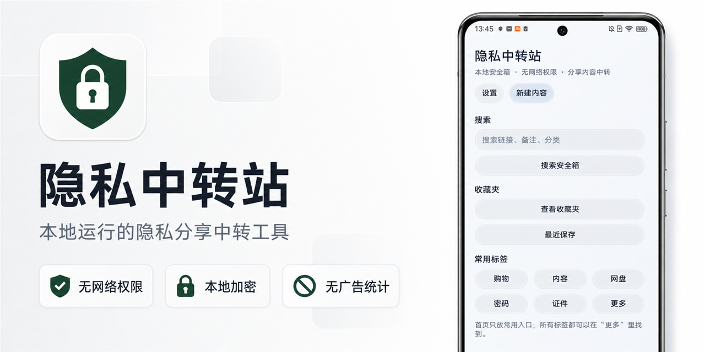
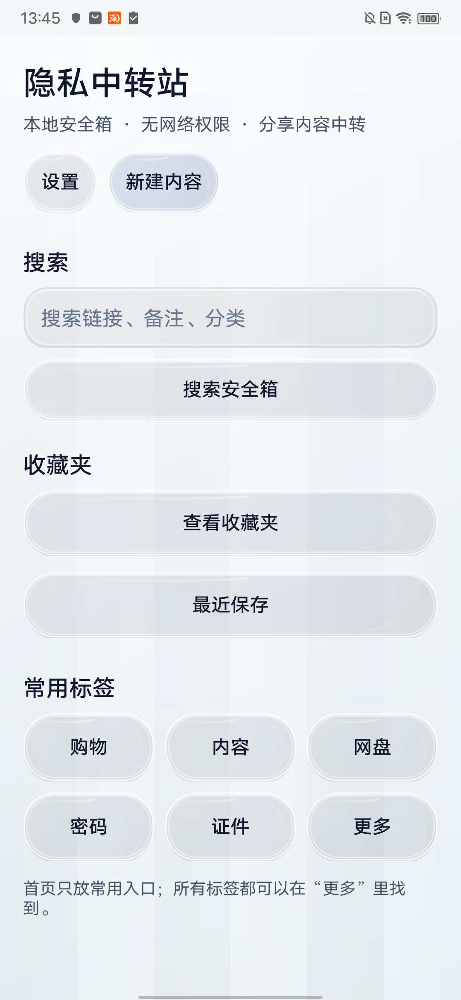

# 隐私中转站 Android



一个由用户主动触发、默认离线运行的 Android 隐私中转工具。即使关闭购物、内容和网盘 App 的剪贴板读取能力，也能通过系统分享或通知栏入口保存、识别并打开收到的链接和口令。

**[下载最新版 APK](https://github.com/hzy7003-bit/PrivacyHub-Android-Preview/releases/latest)** · **[查看隐私证据](docs/SecurityEvidence.md)** · **[安装说明](docs/Install.md)**

> 当前公开测试版：`v0.9.27-beta`。公测包使用独立正式证书签名；已安装 Debug 包的设备不能直接覆盖安装 Release 包。

## 为什么需要它

常见购物和内容 App 会依赖系统剪贴板识别分享口令。隐私中转站把这个过程改为用户主动操作：内容只进入本地安全箱，由本机完成解析和路由，不要求目标 App 读取剪贴板。

```text
收到链接或口令
       ↓
复制后点击通知栏“保存并跳转”
或使用系统“分享”发送到隐私中转站
       ↓
本地识别、分类并加密保存
       ↓
打开目标 App；失败时使用浏览器兜底
```

## 产品界面

<p align="center">
  
</p>

首页提供搜索、收藏夹、最近保存和常用分类入口。截图仅展示空白界面，不包含安全箱正文、设备码或 License 信息。

## 核心能力

- **通知栏保存**：复制文本后点击“保存到安全箱”或“保存并跳转”。
- **系统分享接收**：支持 `ACTION_SEND` 和 `ACTION_PROCESS_TEXT`。
- **本地安全箱**：保存文本、链接、备注、来源、时间、收藏和分类。
- **链接识别与路由**：覆盖淘宝、京东、拼多多、小红书、抖音、快手、B 站、微博及普通网页。
- **网盘识别**：覆盖百度、夸克、迅雷、阿里、蓝奏、123、天翼和移动网盘，并保存明确的提取码。
- **淘宝场景**：支持购物口令、普通代付、闪购代付以及 `m.tb.cn`、`e.tb.cn` 短链。
- **链接净化**：保守移除常见追踪参数，同时保留业务必需参数。
- **本地诊断**：生成不包含安全箱正文的设备与入口诊断信息，便于离线反馈 ROM 问题。

## Pro 功能

- ECDSA P-256 离线永久 License 与设备绑定。
- AES-256-GCM 加密离线备份及跨设备恢复。
- Android Autofill 系统自动填充 Beta。
- 网盘提取码辅助 Beta：需用户主动开启专用无障碍服务，只执行一次性文本填入，不自动确认、登录或下载。

## 隐私承诺与可核验事实

- Release APK **不声明** `INTERNET` 或 `ACCESS_NETWORK_STATE`。
- 无广告 SDK、无统计 SDK、无云同步。
- 安全箱使用 Room + SQLCipher，数据库密钥由 Android Keystore 管理。
- 基础功能不依赖无障碍；网盘提取码辅助是默认关闭的可选 Pro Beta 功能。
- App 不申请 Root，不读取 IMEI、手机号或 SIM 信息。

最新版 APK、SHA-256、签名证书摘要、权限清单及本地复查命令见 [安全与构建证据](docs/SecurityEvidence.md)。完整说明见 [隐私与权限说明](docs/Privacy.md)。

## 兼容性边界

Android 10+ 和不同厂商 ROM 会限制后台剪贴板读取、通知常驻、磁贴和长按文本菜单。通知栏入口通常比磁贴更稳定，但系统强制停止、权限关闭或厂商电池策略仍可能让它消失。

详见 [已知问题](docs/KnownIssues.md) 和 [项目进度](docs/ProjectStatus.md)。

## 下载与校验

- [进入 Releases](https://github.com/hzy7003-bit/PrivacyHub-Android-Preview/releases/latest)
- 当前 APK SHA-256：`36EEE6449DD6300C02E4924B4826F2983B869CAB9258C86DDD6F5E38E6C31EF6`
- 最低支持 Android 8.0（API 26）

## 反馈与关注

- 遇到异常：提交 [Bug 报告](https://github.com/hzy7003-bit/PrivacyHub-Android-Preview/issues/new/choose)。
- ROM 行为不同：提交兼容性报告，诊断截图中不要包含安全箱正文。
- 想参与讨论：进入 [Discussions](https://github.com/hzy7003-bit/PrivacyHub-Android-Preview/discussions)。

如果这个项目解决了你的实际问题，可以点一个 Star。它用于关注版本、兼容性和隐私设计更新，不影响任何 App 功能。

## 仓库边界

这是公开下载、文档和反馈仓库，不是开源源码仓库。Android 源码、签名文件、License 私钥和用户数据均不在此仓库中；具体授权边界见 [许可说明](LICENSE_NOTE.md)。
